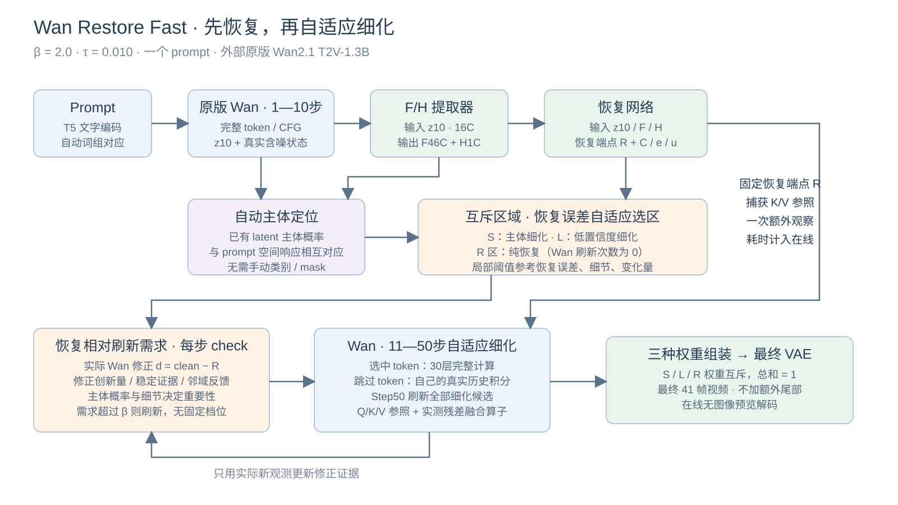
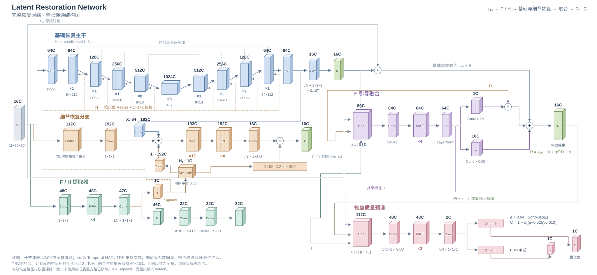

# 方法与网络说明



## 1. 输入不是同一个「第十步 latent」

噪声状态 `x10` 用来继续原生时间线；恢复网络接收的是第十次 Wan 预测得到的 clean prediction `z10 = x - σv`。两者不能混用。`z9` 仅用于估计局部变化，推理没有读取 GT50。

默认视频 832×480、41 帧、16fps；VAE latent 为 `[B,16,11,60,104]`，Wan patch token 网格为 `11×30×52`。恢复网络内部将空间 padding 到 `64×112`，输出裁回原尺寸，时间维不下采样。

## 2. 完整恢复网络



| 组件 | 精确结构及作用 |
|---|---|
| F/H 提取器 | Conv3D16→48，4×TemporalNAF，LN，Conv48→47；前46通道为 F，末1通道 sigmoid 为 H。95,567 参数 |
| 基础主干 | U-Net；encoder64/128/256/512 对应1/1/1/8个 NAF，bottleneck1024×6；decoder512/256/128/64各1个 NAF，同尺度 skip 相加；H 在各尺度投影相加 |
| 基础残差 B | 最后64通道经 LN、1×3×3 Conv→16，乘0.107 |
| 细节分支 | z10 的7组16通道时空差分→112通道；与主干64通道 X、平滑后的 H 分别投影到192后相加；12×NAF、4×TRF（dilation1/2/1/2）、LN、Conv→16 |
| 细节残差 D | 细节输出乘 `0.195 × (0.2 + 0.8 H̄)`；H̄ 为0.35权重的时间平滑 |
| F 引导融合 | F46→32→32；拼接 `[z10,B,D,I]` 得80通道，Conv→64、4×NAF、LN；输出 `g=2sigmoid(...)` 和 `δ=.05Conv(...)` |
| 恢复结果 R | 实际运算保留原分组：`z10+B+D+((g−1)D+δ)` |
| 有效质量头 | 拼接隐藏特征64、I32、`abs(R−z10)`16，共112；Conv→48、SiLU、2×NAF、LN、Conv→2；输出误差 e 与 latent 风险 u |
| C/e/u | `e=.04 softplus(q0)`；`C=1−sigmoid((e−.025)/.010)`；`u=sigmoid(q1)` |
| latent 主体头 | 拼接 z10/F/H 共63通道；Conv63→32、4×NAF、LN、Conv→1。88,481 参数；sigmoid 后得到主体概率 |

恢复器（不含提取器和主体头）保留 72,911,811 参数；三个网络共 73,095,859 参数。主干内未被使用的旧质量头已经删除，图中只保留实际参与输出的分支。

F 是从 latent 预测的图像描述特征；其中含纹理、颜色与时间差分监督目标。在线不会运行 AlexNet 或先解码图像。H 是细节强度，供细节恢复与重要性判断使用；它不等于恢复质量。C/e/u 会参考 R 与原输入的差异，但仍只是预测。

**NAF**：归一化 → 点卷积扩张 → 空间/时间 depthwise 卷积 → 两半特征相乘的 SimpleGate → 全局通道缩放 → 残差；再经过第二个门控前馈残差。**TRF**：拼接当前/前/后特征及前后差值，投影、空间 depthwise、门控、投影并加回输入，专门补充时间邻域信息。完整实现见 `models/blocks.py`。

## 3. 根据 prompt 自动选主体

T5 tokenizer 将 prompt 合成词组，只排除语法功能词，没有 dog/person 一类人工类别表。Step10 条件分支的第5、10、15、20层（从0计数）提供每个词组在 token 上的对应图。

用已有 latent 主体概率计算每个词组在前景与背景的平均响应差；正差值的平方经归一化后作为词组权重。加权的文字对应图和主体头按 logit 的0.5/1.5比例结合，再在 token 网格做高低阈值连通域筛选，得到清楚的主体边界。没有有效词组时自动使用中性文字条件，仍能运行。

主体头使用过离线 YOLOE 教师标签；这次沿用已有权重，在线完全不调用检测器。自动选择不保证每个复杂、多主体 prompt 的语义都正确。

前景标准来自训练标签。该主体头后续训练的标签生成脚本，把 prompt 中的词按 person、dog、cow、horse、cat 五组类别匹配，多个类别同时出现时取最先匹配的类别，再用离线 YOLOE 分割该类别作为前景标签。这是训练时的标签规则；在线词组加权没有使用这个类别表。

`SubjectHead` 本身只读取 z10/F/H，不直接接收 prompt。它预测粗前景后，才结合 Wan 的文字注意力调整主体概率。因此这是具有训练类别偏向的区域预测，加上 prompt 辅助定位，不是任意语义主体都能被正确识别的保证。此主体头在整体方法图的“自动主体定位”中，独立于输出 R/C 的恢复器分支。


## 4. 区域与阈值

误差 e 经固定的离线单调标定，得到 token 的预测恢复误差 E。变化 M 来自 `abs(z10−z9)` 的局部均值及全局归一化；细节 H 做局部池化。

```text
局部容许误差 T = τ × (1 − .25×主体) × (1 + .10×(1−H))
                  / (1 + .20×M + .15×H)
归一化风险 ρ = (E + .003×M) / T
```

再传播0.75权重的邻域最大风险，并保护高风险主体边界。ρ超过1成为细化候选，其他 token 直接由恢复结果负责。τ=.010 是默认整体容许尺度，**实际阈值图 T 随 prompt、恢复误差、位置和细节改变**。S/L/R 的归属在 Step10 后确定，三者互斥；S∪L 内每步是否刷新继续动态判断。

## 5. 刷新需求紧贴恢复结果

真实刷新时，记录 `d = Wan 当前 clean prediction − R`，它表示 Wan 对恢复结果已经做出的修正。用上两次真实修正预测趋势；新观察偏离预测多少，形成修正意外量。稳定的修正会累计证据，减少剩余先验风险；邻近区域刚发现的新修正也会提高当前 token 的需求。

```text
I = 1 + 3×主体概率 + .5×H
h = 距离该 token 上次真实刷新的 log-SNR 间距
scale = RMS(已观测修正 d) + .25×u + .02
需求 = I × h² × [ρ/(1+稳定证据) + 修正创新率/scale + 邻域新修正/scale]
需求 ≥ β 时刷新，默认 β=2.0。
```

每个原生步都算这个轻量 check，但只有到期 token 才做昂贵 Wan 计算。β 是连续需求阈值，不是隔2步，也没有7/8/10/12步几个档。初始已观测修正为0，避免把恢复网络自己从 z10 到 R 的修改误当作后续 Wan 反馈。最后一步刷新所有候选，是融合边界约束。

跳过时由每个 token 自己的两个真实 Wan 观测做 UniPC-2 积分；纯恢复区使用 `R + (post10−R) × σ/σ10` 的恢复端点轨迹。没有额外随机加噪，也没有把跳过的估计写成新的真实模型历史。

## 6. 我们结构带来的计算流加速

固定 R 给出了全视频的端点参照，因此可以预先捕获 R 的 K/V，与 Step10 K/V 形成随噪声位置变化的参照。只更新被选中 token 的 Q/K/V、attention 和 FFN，其他 token 的 K/V 使用固定参照加最近实测残差。Triton 将参照插值、残差更新和输出合成一次处理，减少中间张量与显存搬运。

融合算子与重排不会再增加新近似；但恢复端点参照、token 跳过本身是本方法的近似。原版逐步全 token Wan 没有这个预先恢复端点，不能直接照搬这条固定参照计算流。LayerNorm/残差/CFG 合批属于辅助算子优化，其本身不是本方法独有贡献。
