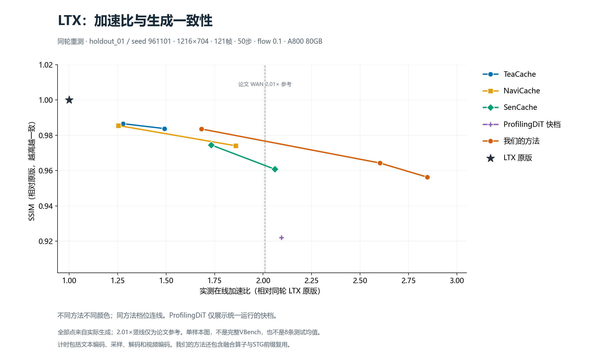

# LTX 全方法速度与生成一致性

ProfilingDiT 只保留速度快档，其它方法沿用已有档位。下表和图来自同一轮A800上的11个原版/方法档位生成，使用同一提示词、种子和完整生成参数。SSIM/LPIPS比较全121帧，属于对原版的相似度，非VBench官方分数。

| 方法/档位 | 在线秒数 | 加速比 | SSIM ↑ | LPIPS ↓ |
|---|---:|---:|---:|---:|
| LTX 原版 | 95.59 | 1.000× | 1.0000 | 0.00000 |
| TeaCache 慢 | 74.77 | 1.278× | 0.9866 | 0.00354 |
| TeaCache 快 | 64.06 | 1.492× | 0.9838 | 0.00524 |
| NaviCache 慢 | 76.23 | 1.254× | 0.9855 | 0.00409 |
| NaviCache 快 | 51.41 | 1.859× | 0.9741 | 0.01499 |
| SenCache 慢 | 55.19 | 1.732× | 0.9745 | 0.01074 |
| SenCache 快 | 46.40 | 2.060× | 0.9608 | 0.02154 |
| 我们的方法 质量档 | 56.84 | 1.682× | 0.9836 | 0.00470 |
| 我们的方法 均衡档 | 36.73 | 2.603× | 0.9643 | 0.02017 |
| 我们的方法 快档 | 33.58 | 2.847× | 0.9563 | 0.02722 |
| ProfilingDiT 快档 | 45.63 | 2.095× | 0.9221 | 0.07418 |

## ProfilingDiT 快档的选择与8条测试

目标2.1×，允许±5%速度误差。12个候选在8条验证视频上比较，按实测速度选择 `profile_speed_k24_i12_3`，验证集实际 2.071×。SSIM/LPIPS不参与筛选。

固定后8条既有测试视频的总时长比为 2.069×，平均SSIM 0.8736，平均LPIPS 0.10452。这是8条汇总，与上方单条图的数据范围不同。

缓存层 `[2, 4, 6, 7, 8, 9, 10, 11, 12, 13, 14, 15, 16, 17, 18, 19, 20, 21, 22, 23, 24, 25, 26, 27]`；刷新间隔 12→3，前10步和最后一步完整计算。增加缓存层会包含前景注意力较高的层，质量变化按实际结果保留。

官方论文表2对WAN报告497秒→247秒、2.01×，只有一档。本次LTX 2.1×目标属于适配选择，非官方参数；模型、分辨率、硬件不同。[ProfilingDiT论文v2](https://arxiv.org/html/2504.03140#S3.T2)

| 测试视频 | 原版秒数 | 快档秒数 | 加速比 | SSIM ↑ | LPIPS ↓ |
|---|---:|---:|---:|---:|---:|
| holdout_01 | 95.27 | 45.68 | 2.085× | 0.9221 | 0.07418 |
| holdout_02 | 96.17 | 46.83 | 2.054× | 0.8578 | 0.08195 |
| holdout_03 | 93.44 | 43.69 | 2.139× | 0.9422 | 0.06585 |
| holdout_04 | 94.96 | 45.33 | 2.095× | 0.9040 | 0.04359 |
| fresh_01 | 93.94 | 44.39 | 2.116× | 0.9521 | 0.03985 |
| fresh_02 | 94.64 | 45.12 | 2.097× | 0.8757 | 0.08481 |
| fresh_03 | 102.88 | 53.63 | 1.919× | 0.6693 | 0.37018 |
| fresh_04 | 95.77 | 46.05 | 2.080× | 0.8657 | 0.07576 |

最低SSIM为 `fresh_03` 的 0.6693；最高LPIPS为 0.37018。均值不能代表每个场景，全部结果均保留，没有剔除低相似度案例。

## 复现与边界

- 固定 LTX 2B 0.9.6、1216×704、121帧、50步、dynamic flow 0.1。
- 在线计时包括文本编码、采样、解码和编码；不包括模型加载、离线profiling及质量评分。
- ProfilingDiT采用既有946短序列+32长序列离线统计；RGB分割适配与原论文PCA方案不同，无需重新训练。
- 我们的方法使用既有训练恢复器及融合算子/STG前缀优化；不能把差异全部归因于缓存。
- 训练和离线统计覆盖VBench提示词，不能宣称全套VBench是未见提示词测试。8条测试也曾展示过，本轮不用于选档。
- 旧ProfilingDiT质量档仅留作历史，不加入本版本默认比较。
- 默认完整VBench为11个原版/方法档位，每档6220条，共68420条，留给另一服务器执行；本轮没有运行完整VBench。

## 附录：官方默认参数映射到 LTX 的实测

这里回答“按官方参数运行多快”。官方没有LTX配置；本组将WAN的6步预热、固定6步刷新和28/40缓存层比例映射到LTX的20/28层，沿用固定的LTX注意力排序，末步不额外强制全量。不按速度或质量调参，3条固定视频单独重测。

| 视频 | 原版秒数 | 映射配置秒数 | 加速比 | SSIM ↑ | LPIPS ↓ |
|---|---:|---:|---:|---:|---:|
| holdout_01 | 95.950 | 50.275 | 1.909× | 0.91845 | 0.07003 |
| holdout_02 | 96.470 | 51.454 | 1.875× | 0.86858 | 0.07672 |
| holdout_03 | 93.571 | 48.129 | 1.944× | 0.92825 | 0.08966 |

3条平均耗时：原版 95.331 秒，映射配置 49.953 秒；总时长比 1.908×。平均SSIM 0.90509，平均LPIPS 0.07880。原版回放视频逐位一致。

这是LTX适配补测，非官方LTX实现或完整VBench结果，不加入主比较图或默认11档运行列表。官方公开脚本包含随机背景层扫描，参数默认值不能直接认定为论文2.01×那一行的精确复现配方。[官方代码](https://github.com/GeekGuru123/ProfilingDiT/blob/main/Wan2.1/generate.py)
