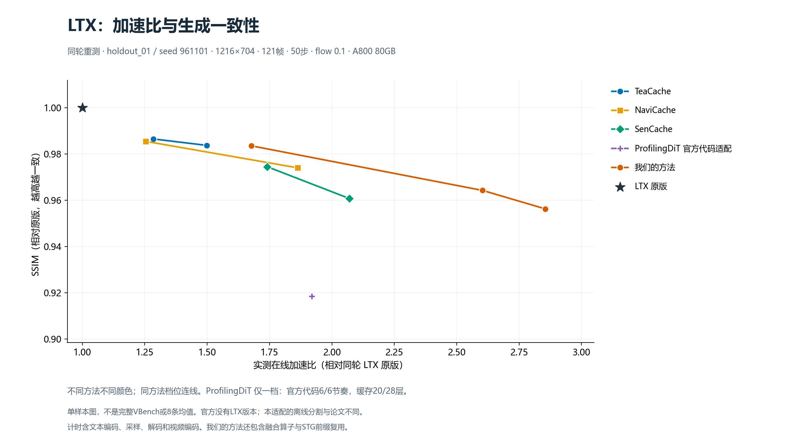

# LTX 全方法速度与生成一致性

当前只保留 `profiling_official` 一个ProfilingDiT入口。为减少选档的自由度，直接调用固定提交的官方Wan缓存代码，采用默认6/6刷新节奏、按比例映射20/28缓存层；不以实测速度或质量筛选参数。官方没有LTX实现，本结果应标为“ProfilingDiT official-code LTX port (mapped defaults)”。

下表来自同一轮顺序运行的11档单样本测试。SSIM/LPIPS为相对原版的全121帧相似度，不是VBench官方总分。

| 方法/档位 | 在线秒数 | 加速比 | SSIM ↑ | LPIPS ↓ |
|---|---:|---:|---:|---:|
| LTX 原版 | 95.58 | 1.000× | 1.0000 | 0.00000 |
| TeaCache 慢 | 74.40 | 1.285× | 0.9866 | 0.00354 |
| TeaCache 快 | 63.79 | 1.498× | 0.9838 | 0.00524 |
| NaviCache 慢 | 76.19 | 1.254× | 0.9855 | 0.00409 |
| NaviCache 快 | 51.29 | 1.863× | 0.9741 | 0.01499 |
| SenCache 慢 | 54.89 | 1.741× | 0.9745 | 0.01074 |
| SenCache 快 | 46.18 | 2.070× | 0.9608 | 0.02154 |
| 我们的方法 质量档 | 56.96 | 1.678× | 0.9836 | 0.00470 |
| 我们的方法 均衡档 | 36.71 | 2.604× | 0.9643 | 0.02017 |
| 我们的方法 快档 | 33.48 | 2.855× | 0.9563 | 0.02722 |
| ProfilingDiT 官方代码适配 | 49.78 | 1.920× | 0.9185 | 0.07003 |

## ProfilingDiT 固定8条对照

按原版总时长/适配版总时长统计，加速 1.885×；平均原版 95.575 秒、适配版 50.707 秒；平均 SSIM 0.86432、LPIPS 0.10492。这些样本此前已检查过，不能称为新的独立测试集。本轮结果不用于反调配置。

| 样本 | 原版秒数 | 适配版秒数 | 加速比 | SSIM ↑ | LPIPS ↓ |
|---|---:|---:|---:|---:|---:|
| holdout_01 | 95.320 | 50.072 | 1.904× | 0.91845 | 0.07003 |
| holdout_02 | 96.425 | 51.339 | 1.878× | 0.86858 | 0.07672 |
| holdout_03 | 92.993 | 48.082 | 1.934× | 0.92825 | 0.08966 |
| holdout_04 | 95.066 | 49.733 | 1.912× | 0.87699 | 0.06038 |
| fresh_01 | 93.545 | 48.766 | 1.918× | 0.95063 | 0.04854 |
| fresh_02 | 94.536 | 49.498 | 1.910× | 0.86110 | 0.09393 |
| fresh_03 | 101.739 | 57.887 | 1.758× | 0.67790 | 0.31262 |
| fresh_04 | 94.978 | 50.276 | 1.889× | 0.83263 | 0.08748 |

## 复现与比较边界

- 官方源固定为 `fa9d1983418b481cc37eb69e7f6c5a3ec6e182a1` 的 `Wan2.1/wan/cache.py`，逐字节保留；LTX包装直接调用 `DitCache.forward_single_original`。
- 公开代码默认预热6步、每6步刷新。官方28/40层比例按最近整数映射为LTX20/28层，层排序取既有冻结注意力统计；这仍属于跨模型适配选择。官方生成脚本还包含随机选层循环，不能断言默认值就是论文表2最终实验参数。
- 原论文离线流程使用噪声预测PCA前景处理；本版本使用Grounding DINO + SAM2 RGB分割，保留683/946短记录及24/32长记录的有效统计。层比例映射也不同于论文阈值分组，详见[协议](PROFILING_PROTOCOL.md)。
- 50步中实际计算680/1400个块；最后一步遵循官方固定分支，不额外强制全算。21项CPU检查包括微型28层模型float32/bfloat16全50步与直接官方调用逐位一致、缓存状态清理和hook撤销。真实生成后原版重放验证无残留。
- 所有方法共用LTX 2B 0.9.6、1216×704、121帧、50步、dynamic flow 0.1及原CFG/STG设置。计时包含文本编码、采样、解码和视频编码，排除模型加载、离线profiling与评分；同卡并发会使计时无效。
- SSIM采用FP64、832×480面积缩放；LPIPS Alex采用416×240面积缩放，比较全部121帧。
- 初始评分脚本错误地要求全部identity字段相同，因SenCache/恢复器的专属资产哈希而暂停。修正后分别核验公共底座与方法专属资产，6种负例检查通过；28条原始视频、run.json和计时均未改动，证据见tests/scoring_guard_correction.json。
- 其它方法使用既有适配和参数；我们的方法还包含融合算子/STG前缀复用。这是整套方法比较，不能将全部收益只归因于缓存。
- 恢复器训练及离线profiling涉及VBench提示词，完整VBench不能标为全未见数据。11档×6220=68420条完整测试留给另一服务器，本轮仅28条生成、18对质量比较。
- 旧速度选档v2保留在历史Release，本包不提供第二个Profiling入口。

来源：[ProfilingDiT论文v2](https://arxiv.org/html/2504.03140)、[固定官方缓存源](https://github.com/GeekGuru123/ProfilingDiT/blob/fa9d1983418b481cc37eb69e7f6c5a3ec6e182a1/Wan2.1/wan/cache.py)。论文WAN的2.01×不作为本次LTX选档目标。
