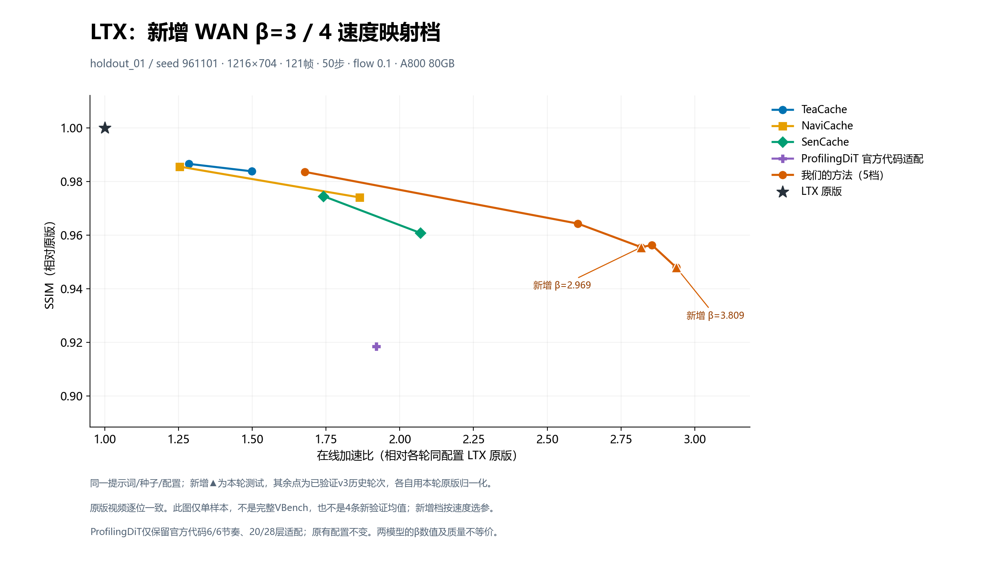

# LTX 新增 WAN β=3 / 4 速度映射测试

此次仅调整本项目方法的 `controller.budget`，沿用原LTX恢复器、融合算子、STG前缀复用及全部生成设置。原有三个质量映射档与其它方法保持不变。新增两档按相对原版的在线加速比选择，不声称与WAN质量等价。

## 新的4条验证结果

| WAN参考档 | 目标加速比 | LTX实际β | 校准加速比 | 验证加速比 | 平均秒数 | SSIM ↑ | LPIPS ↓ |
|---|---:|---:|---:|---:|---:|---:|---:|
| β=3.0 | 2.7150× | 2.969 | 2.7292× | 2.7964× | 33.704 | 0.95578 | 0.03236 |
| β=4.0 | 2.8099× | 3.809 | 2.8156× | 2.9022× | 32.476 | 0.95000 | 0.03963 |

验证原版平均 94.250 秒。加速比按原版总时长/方法总时长统计，质量为4条视频平均，每条比较全部121帧。验证结果未用于重新选参。速度匹配随硬件和提示词变化，不能视为任意任务都恰好等于目标。

| 样本 | 方法 | 原版秒数 | 方法秒数 | 加速比 | SSIM ↑ | LPIPS ↓ |
|---|---|---:|---:|---:|---:|---:|
| speed_holdout_01 | ours_wan_speed_3 | 92.286 | 31.208 | 2.9571× | 0.97971 | 0.01037 |
| speed_holdout_01 | ours_wan_speed_4 | 92.286 | 29.807 | 3.0961× | 0.97669 | 0.01315 |
| speed_holdout_02 | ours_wan_speed_3 | 96.234 | 36.839 | 2.6123× | 0.92125 | 0.05128 |
| speed_holdout_02 | ours_wan_speed_4 | 96.234 | 35.623 | 2.7014× | 0.90585 | 0.05957 |
| speed_holdout_03 | ours_wan_speed_3 | 94.140 | 32.976 | 2.8548× | 0.95650 | 0.02765 |
| speed_holdout_03 | ours_wan_speed_4 | 94.140 | 31.543 | 2.9845× | 0.95180 | 0.02956 |
| speed_holdout_04 | ours_wan_speed_3 | 94.340 | 33.794 | 2.7916× | 0.96567 | 0.04013 |
| speed_holdout_04 | ours_wan_speed_4 | 94.340 | 32.929 | 2.8650× | 0.96566 | 0.05625 |

## 校准与边界

WAN目标来自此前9条固定样本实测：原版74.243秒，β=3为27.346秒/2.715007×，β=4为26.422秒/2.809891×。它是本项目在WAN上的测试结果，不是LTX官方阈值。WAN与LTX保留各自帧数、分辨率和采样设置，且两模型使用不同提示词集合，因此该映射只是本次操作性速度匹配。

LTX使用3条校准提示词，每候选重复两次计时；最多7个候选，只按加速比误差选择两个不同且有序的β。实际生成59条（含校准、排除的预热、验证、图表样本和原版回放），质量比较10对。阈值在4条新验证提示词执行前冻结。同一候选/提示词的两次计时最大相对差为0.866%。

计时包括文本编码、采样、VAE解码和视频编码，排除模型加载和指标计算。TimingGuard检查同卡并发；重复生成的视频须逐位一致。SSIM采用FP64、torch area缩放到832×480；LPIPS Alex缩放到416×240。WAN旧报告质量指标的实现不同，这次没有用它来筛选LTX质量。

生成设置保持1216×704、121帧、50步、dynamic flow 0.1、30fps及原CFG/STG参数不变。恢复器训练过VBench提示词，不能把完整VBench称为完全未见；此次新的4条提示词是本次阈值选择之外的验证，不是VBench总分。

## 单样本全方法图



图中的旧点来自v3已验证轮次，新点来自本次补测；使用同一prompt/seed/设置和同一张GPU，原版视频逐位一致，各自用对应轮次原版时间归一化。没有把它标为全方法同轮重测，也没有将它与4条验证均值混合。

## 统一运行入口

```bash
python run.py --method ours_wan_speed_3 --prompt "A small boat drifts slowly on calm water." --seed 20260912 --out outputs/speed3
python run.py --method ours_wan_speed_4 --prompt "A small boat drifts slowly on calm water." --seed 20260912 --out outputs/speed4
python benchmark.py plan --methods all
```

两个新配置只增加到统一methods.json。另加用户指定的直接beta五档，默认完整VBench为18×6,220=111,960条，本次未运行完整VBench。权重与v3完全相同，保持原公开权重的SHA256与下载入口。
