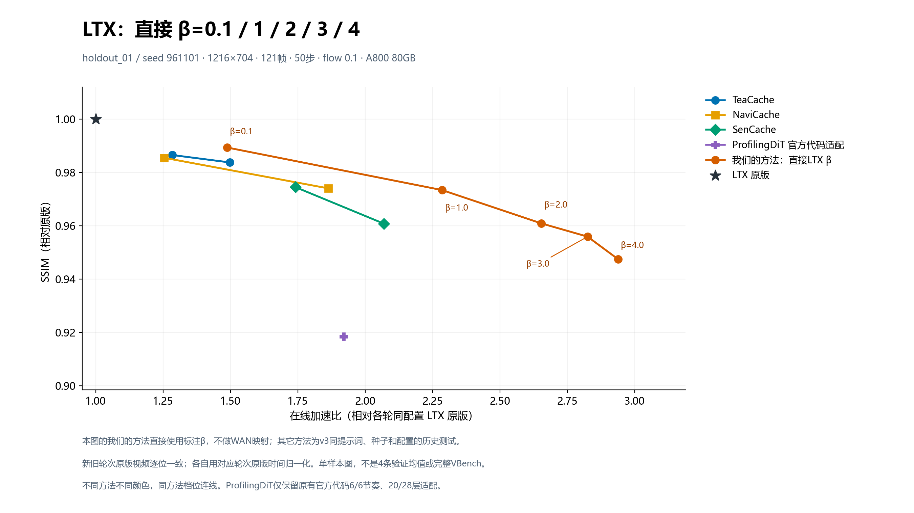

# LTX 直接beta五档测速与质量

按用户指定直接运行 LTX `controller.budget=0.1、1.0、2.0、3.0、4.0`，不做WAN映射，不按结果选择或修改阈值。流速、帧数、分辨率、步数、CFG/STG、融合算子和恢复器权重均保持当前设置。

## 4条相同提示词的固定参数结果

| LTX beta | 平均原版秒数 | 平均方法秒数 | 加速比 | SSIM ↑ | LPIPS ↓ | 最低单条SSIM |
|---|---:|---:|---:|---:|---:|---:|
| 0.1 | 94.242 | 63.250 | 1.4900× | 0.98945 | 0.00334 | 0.98063 |
| 1.0 | 94.242 | 42.069 | 2.2402× | 0.97529 | 0.01903 | 0.95918 |
| 2.0 | 94.242 | 36.044 | 2.6147× | 0.96535 | 0.02642 | 0.93942 |
| 3.0 | 94.242 | 33.627 | 2.8026× | 0.95494 | 0.03310 | 0.91881 |
| 4.0 | 94.242 | 32.286 | 2.9190× | 0.95092 | 0.03956 | 0.90934 |

加速比为原版总时长/方法总时长。原版为本轮新生成，对每档使用相同prompt、seed与全部生成配置。每条指标比较所有121帧；SSIM不是VBench官方评分。所有五档使用相同的四条验证提示词与配对种子。

| 样本 | beta | 原版秒数 | 方法秒数 | 加速比 | SSIM ↑ | LPIPS ↓ |
|---|---:|---:|---:|---:|---:|---:|
| speed_holdout_01 | 0.1 | 92.380 | 61.428 | 1.5039× | 0.99343 | 0.00080 |
| speed_holdout_01 | 1.0 | 92.380 | 38.963 | 2.3710× | 0.98750 | 0.00572 |
| speed_holdout_01 | 2.0 | 92.380 | 33.148 | 2.7869× | 0.98374 | 0.00790 |
| speed_holdout_01 | 3.0 | 92.380 | 30.963 | 2.9836× | 0.97904 | 0.01059 |
| speed_holdout_01 | 4.0 | 92.380 | 29.677 | 3.1129× | 0.97616 | 0.01394 |
| speed_holdout_02 | 0.1 | 96.127 | 65.061 | 1.4775× | 0.98063 | 0.00984 |
| speed_holdout_02 | 1.0 | 96.127 | 45.889 | 2.0948× | 0.95918 | 0.02587 |
| speed_holdout_02 | 2.0 | 96.127 | 39.572 | 2.4291× | 0.93942 | 0.04083 |
| speed_holdout_02 | 3.0 | 96.127 | 36.911 | 2.6043× | 0.91881 | 0.05343 |
| speed_holdout_02 | 4.0 | 96.127 | 35.478 | 2.7094× | 0.90934 | 0.05963 |
| speed_holdout_03 | 0.1 | 93.962 | 62.907 | 1.4937× | 0.98980 | 0.00132 |
| speed_holdout_03 | 1.0 | 93.962 | 40.877 | 2.2987× | 0.97160 | 0.01490 |
| speed_holdout_03 | 2.0 | 93.962 | 34.956 | 2.6880× | 0.96540 | 0.02028 |
| speed_holdout_03 | 3.0 | 93.962 | 32.633 | 2.8794× | 0.95603 | 0.02802 |
| speed_holdout_03 | 4.0 | 93.962 | 31.166 | 3.0149× | 0.95338 | 0.02837 |
| speed_holdout_04 | 0.1 | 94.498 | 63.602 | 1.4858× | 0.99394 | 0.00141 |
| speed_holdout_04 | 1.0 | 94.498 | 42.547 | 2.2210× | 0.98287 | 0.02965 |
| speed_holdout_04 | 2.0 | 94.498 | 36.498 | 2.5891× | 0.97283 | 0.03666 |
| speed_holdout_04 | 3.0 | 94.498 | 34.001 | 2.7793× | 0.96590 | 0.04035 |
| speed_holdout_04 | 4.0 | 94.498 | 32.823 | 2.8790× | 0.96479 | 0.05629 |

## 单样本全方法点线图



图上我们的方法使用本次直接beta五档，其它方法使用v3已验证的历史轮次。同一提示词、种子、配置和GPU；本轮原版与历史原版视频逐位一致，各自以对应轮次的原版计时归一化。图不是全方法同轮测试，也不是上表4条验证均值。

## 复现与范围

固定LTX 2B 0.9.6，1216×704、121帧、50步、dynamic flow 0.1、30fps及原CFG/STG参数。计时包含文本编码、采样、VAE和视频编码，排除模型加载和评分。TimingGuard拒绝同卡并发；各case轮换执行次序。SSIM为FP64/torch area 832×480；LPIPS Alex为416×240，比较全部帧。

本固定beta实验32条生成：1条排除的预热，4×6条验证，1×6条图表样本，1条末尾原版回放；共25对质量评分。恢复器未重新训练，其他缓存方法与唯一ProfilingDiT适配保持已验证配置。

```bash
python run.py --method ours_beta_0p1 --prompt "A small boat drifts slowly on calm water." --seed 20260912 --out outputs/beta01
python benchmark.py plan --methods ours_beta_0p1 ours_beta_1p0 ours_beta_2p0 ours_beta_3p0 ours_beta_4p0
```

统一包共13档，默认完整VBench13×6,220=80,860条，本次没有运行；可通过`--methods`选择子集。恢复器训练涉及VBench提示词，不称完整VBench为全未见。
